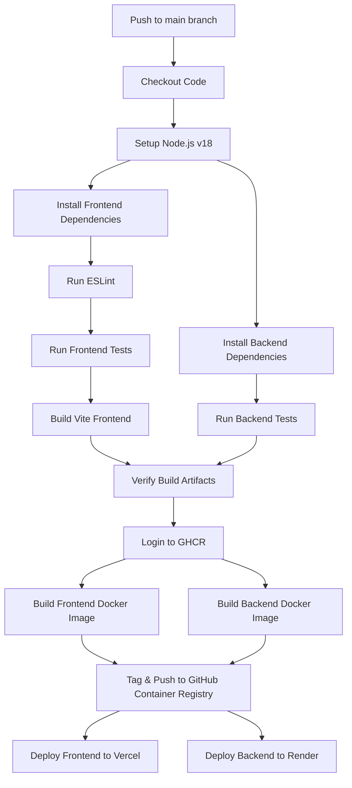

# MERN + AI Code Review Platform

An advanced AI-powered platform for reviewing code, integrating with GitHub, and generating documentation.

## Features
- **Single File & ZIP Review**: Upload code files or entire project structures.
- **GitHub Integration**: Connect via OAuth to automatically fetch and review both public and private repositories.
- **AI Architecture Review & Chat**: Intelligent system architecture breakdown, security flaw detection, missing features, and interactive AI Chat.
- **Documentation Generator**: One-click generation of fully comprehensive `README.md` style documentation.
- **Monaco Editor**: Integrated VS Code style editor.

---

## Docker Installation & Deployment (Phase 12)

This project has been fully containerized using Docker and Docker Compose. You can run the entire frontend and backend stack with a single command, ensuring a consistent environment across any machine.

### Prerequisites
- [Docker](https://docs.docker.com/get-docker/) installed.
- [Docker Compose](https://docs.docker.com/compose/install/) installed.

### Environment Setup
Before building the containers, ensure you have your `.env` files set up.
Create a `server/.env` file with your secrets (Do not commit this file to version control):
```env
PORT=5000
MONGO_URI=your_mongodb_atlas_uri
JWT_SECRET=your_jwt_secret
GROQ_API_KEY=your_groq_api_key
GITHUB_CLIENT_ID=your_github_client_id
GITHUB_CLIENT_SECRET=your_github_client_secret
ENCRYPTION_KEY=your_encryption_key
CLIENT_URL=http://localhost:5173
```

### Build & Run Command
To build and start both the frontend and backend containers in detached mode:
```bash
docker-compose up --build -d
```
- **Frontend** will be accessible at: [http://localhost:5173](http://localhost:5173)
- **Backend** will be accessible at: [http://localhost:5000](http://localhost:5000)

### Stop Command
To gracefully stop the running containers:
```bash
docker-compose down
```

### Rebuild Command
If you make changes to your `package.json` or want to force a fresh build without cache:
```bash
docker-compose build --no-cache
docker-compose up -d
```

### Troubleshooting
- **Port Conflicts**: If port `5000` or `5173` is already in use, stop the conflicting service on your host machine or modify the port mapping in `docker-compose.yml`.
- **MongoDB Connection**: Make sure your MongoDB Atlas cluster has IP Access configured to allow connections from anywhere (`0.0.0.0/0`), as Docker containers will have different dynamic IP addresses than your local host machine.

---

## CI/CD Pipeline Architecture (Phase 13)

This project features an automated, enterprise-grade Continuous Integration and Continuous Deployment (CI/CD) pipeline built with **GitHub Actions**. Every push to the `main` branch triggers a comprehensive validation, build, containerization, and deployment sequence.

### Workflow Diagram



### Automated Stages
The `.github/workflows/ci-cd.yml` runs 15 critical stages:
1. **Checkout & Setup**: Fetches the code and sets up optimized Node.js v18 caching.
2. **Linting & Testing**: Runs `oxlint` on the frontend. Halts the build immediately if quality checks fail.
3. **Build Verification**: Builds the Vite frontend (`dist` folder) to ensure it compiles perfectly.
4. **Dockerization**: Uses multi-stage Docker builds to containerize the Frontend and Backend.
5. **Registry Push**: Pushes the secure Docker images to GitHub Container Registry (`ghcr.io`) tagged with `latest` and the specific Git commit SHA for easy rollbacks.
6. **Zero-Touch Deployment**: 
   - Uses the Vercel CLI to deploy the frontend to the Edge network.
   - Triggers a secure Webhook to Render to deploy the backend.

### Required GitHub Secrets
To make the pipeline function securely, you must configure the following **Repository Secrets** in your GitHub repository (`Settings` -> `Secrets and variables` -> `Actions`):

| Secret Name | Description |
|---|---|
| `VERCEL_TOKEN` | Vercel Personal Access Token for frontend deployment. |
| `VERCEL_ORG_ID` | Your Vercel Organization ID. |
| `VERCEL_PROJECT_ID` | Your Vercel Project ID. |
| `RENDER_DEPLOY_HOOK` | The unique Deploy Hook URL provided by Render for your backend service. |
| `GITHUB_TOKEN` | Automatically provided by GitHub Actions (ensure "Read & Write" permissions are enabled for packages in repo settings). |

*Note: Your environment variables (`MONGODB_URI`, `GROQ_API_KEY`, etc.) should be securely stored in your Render backend dashboard and Vercel frontend dashboard respectively.*

### Rollbacks & Failures
- **Failure Halting**: If any stage (like Linting or Docker Build) fails, the pipeline aborts immediately. **No deployment occurs**.
- **Manual Rollbacks**: Because every Docker image is tagged with the Git commit SHA in GHCR, rolling back is as simple as reverting a git commit or pulling a previous specific image tag from the registry.
